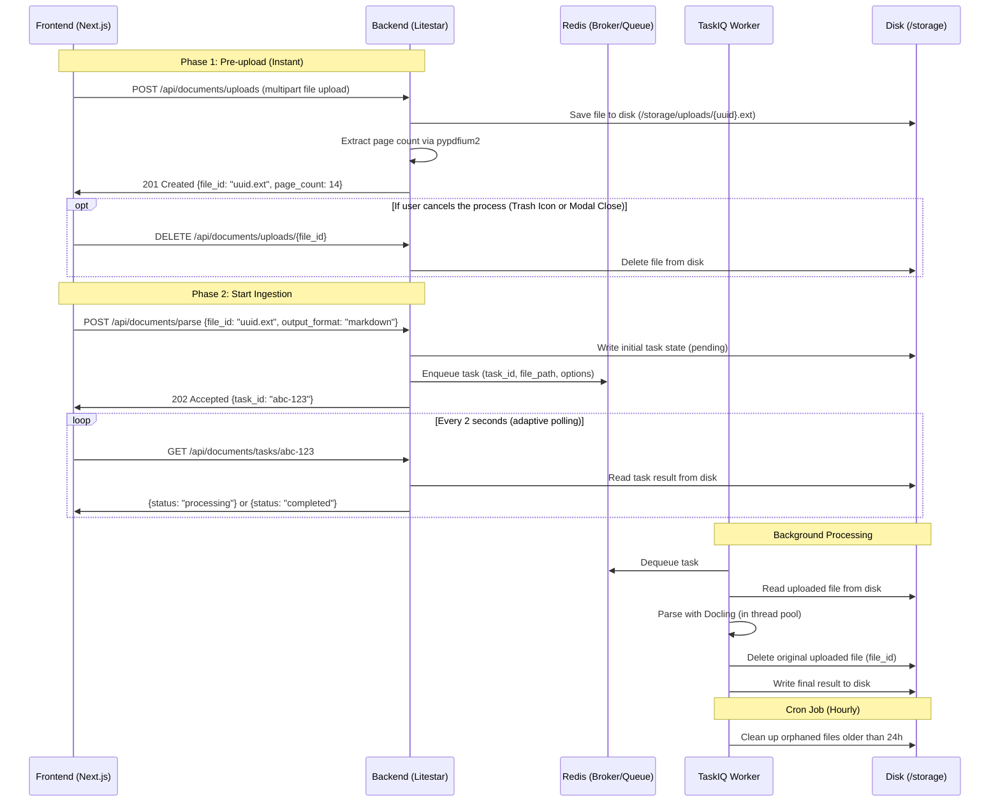

# RAG Ingestion Pipeline

An asynchronous document ingestion pipeline for RAG (Retrieval-Augmented Generation) workflows.

## Overview
This project processes raw documents (like PDFs, etc.) and prepares them for vector search. It is structured as a monorepo containing a Litestar backend and a Next.js frontend, with TaskIQ handling async processing.

**Pipeline Stages:**
1. **Parsing (Current Stage):** Extracts structured content from documents using Docling. Supports Markdown and JSON output formats.
2. **Chunking (Planned):** Splitting the parsed document into semantic chunks.
3. **Embedding (Planned):** Generating vector embeddings for each chunk.
4. **Vector Storage (Planned):** Indexing the embeddings into a Vector Database.

## Architecture



## Tech Stack
- **Backend Framework:** [Litestar](https://github.com/litestar-org/litestar) (Python 3.14)
- **Frontend Framework:** [Next.js](https://github.com/vercel/next.js) 16 (App Router, static export)
- **UI Components:** [shadcn/ui](https://github.com/shadcn-ui/ui) with [Tailwind CSS](https://github.com/tailwindlabs/tailwindcss) v4
- **Task Queue:** [TaskIQ](https://github.com/taskiq-python/taskiq) with [Redis](https://github.com/redis/redis/)
- **Document Parsing:** [Docling](https://github.com/docling-project/docling)
- **State Management:** [Zustand](https://github.com/pmndrs/zustand), [TanStack Query](https://github.com/TanStack/query)
- **Containerization:** [Docker](https://www.docker.com/)
- **Backend Package Management:** [uv](https://github.com/astral-sh/uv)
- **Frontend Package Management:** [pnpm](https://github.com/pnpm/pnpm)
- **Task Runner:** [just](https://github.com/casey/just)
- **Backend Quality:** [ruff](https://github.com/astral-sh/ruff) (lint/format), [ty](https://github.com/astral-sh/ty) (type check)
- **Frontend Quality:** [Ultracite](https://github.com/haydenbleasel/ultracite) / [Biome](https://github.com/biomejs/biome) (lint/format)
- **Logging:** [structlog](https://github.com/hynek/structlog)

## Getting Started

### Prerequisites
- [Docker Desktop](https://www.docker.com/products/docker-desktop/) installed and running

For local development (without Docker):
- Python 3.14+, `uv`
- Node.js 20+, `pnpm`

### Running the Application

The recommended way to run the project is through Docker. This handles all dependencies, including Docling's ML models, inside the container.

**With `just` (recommended):**
```bash
# Start backend, worker, and Redis (frontend runs locally for HMR)
just dev

# Or start the entire stack including the Dockerized frontend
just dev-all
```

**Without `just`:**
```bash
docker compose up --build
```

The Backend API will be available at `http://localhost:8000`. <br>The Frontend UI (when Dockerized) will be available at `http://localhost:3000`.

To shut down:
```bash
just down          # or: docker compose down
```

### Local Development

If you prefer to run without Docker (e.g. for faster iteration on code-only changes):

```bash
# Install all dependencies (backend + frontend)
just install       # or: uv sync && pnpm --dir apps/frontend install

# Start backend server
just dev-backend   # or: uv run --package backend litestar --app apps.backend.app.main:app run --debug --reload

# Start worker process (in a separate terminal)
just dev-worker    # or: uv run --package backend taskiq worker apps.backend.app.core.broker:broker apps.backend.app.features.document_parsing.tasks --reload

# Start frontend dev server (in a separate terminal, with HMR)
just dev-frontend  # or: cd apps/frontend && pnpm dev
```

> **Note:** The Next.js dev server proxies `/api/*` requests to `http://127.0.0.1:8000` automatically via `next.config.ts` rewrites. No manual CORS setup needed for local development.

### Code Quality

Linting, formatting, and type checking run locally regardless of how you run the app. Both backend (Python) and frontend (TypeScript) toolchains run together:

```bash
just check         # runs lint + format + typecheck for both backend and frontend
```

Or individually:
```bash
just lint          # ruff check . && pnpm --dir apps/frontend run check
just format        # ruff format . && pnpm --dir apps/frontend run fix
just typecheck     # ty check && pnpm --dir apps/frontend run typecheck
```

## Contributing
We welcome contributions! To maintain a clean codebase, we follow a strict Pull Request workflow, please always work on a separate branch and never commit directly to `master`.

We use **Conventional Commits** and **Google Release Please** for automated versioning and changelog generation. Please do not manually bump package versions.

See [CONTRIBUTING.md](CONTRIBUTING.md) for full details on our branching strategy, architecture rules, and development setup. For AI agents working on this repository, please see [AGENTS.md](AGENTS.md).
