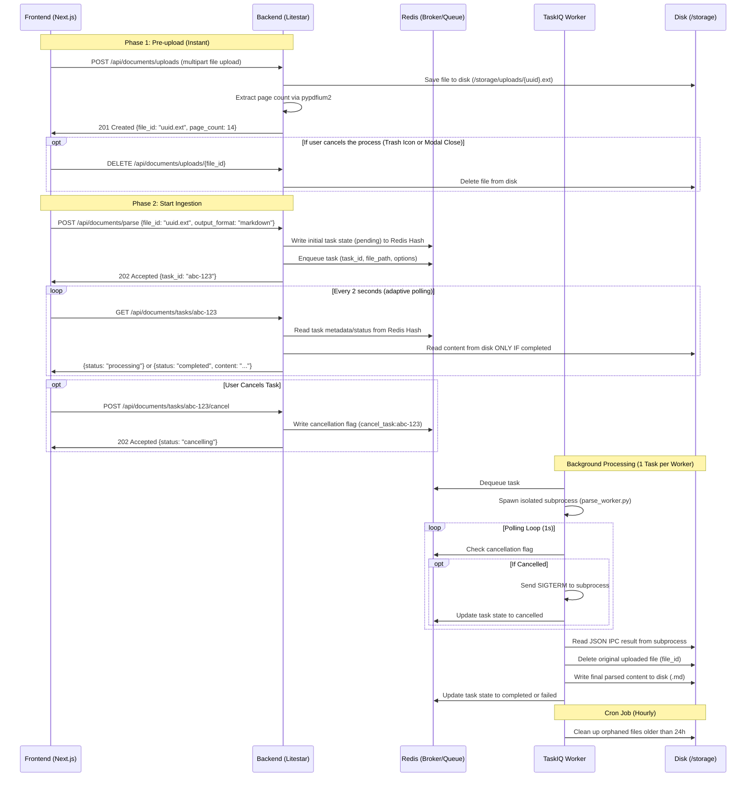

# RAG Ingestion Pipeline

An asynchronous document ingestion pipeline for RAG (Retrieval-Augmented Generation) workflows.

## Overview
This project processes raw documents (like PDFs, etc.) and prepares them for vector search. It is structured as a monorepo containing a Litestar backend and a Next.js frontend, with TaskIQ handling async processing.

**Pipeline Stages:**
1. **Parsing (Current Stage):** Extracts structured content from documents using Docling. Outputs structured Markdown.
2. **Chunking (Planned):** Splitting the parsed document into semantic chunks.
3. **Embedding (Planned):** Generating vector embeddings for each chunk.
4. **Vector Storage (Planned):** Indexing the embeddings into a Vector Database.

## Architecture



## Tech Stack
- **Backend Framework:** [Litestar](https://github.com/litestar-org/litestar) (Python 3.14)
- **Frontend Framework:** [Next.js](https://github.com/vercel/next.js) 16 (App Router, static export)
- **UI Components:** [shadcn/ui](https://github.com/shadcn-ui/ui) with [Tailwind CSS](https://github.com/tailwindlabs/tailwindcss) v4
- **Task Queue:** [TaskIQ](https://github.com/taskiq-python/taskiq) with [Redis](https://github.com/redis/redis/)
- **Document Parsing:** [Docling](https://github.com/docling-project/docling)
- **State Management:** [Zustand](https://github.com/pmndrs/zustand), [TanStack Query](https://github.com/TanStack/query)
- **Containerization:** [Docker](https://www.docker.com/)
- **Backend Package Management:** [uv](https://github.com/astral-sh/uv)
- **Frontend Package Management:** [pnpm](https://github.com/pnpm/pnpm)
- **Task Runner:** [just](https://github.com/casey/just)
- **Backend Quality:** [ruff](https://github.com/astral-sh/ruff) (lint/format), [ty](https://github.com/astral-sh/ty) (type check)
- **Frontend Quality:** [Ultracite](https://github.com/haydenbleasel/ultracite) / [Biome](https://github.com/biomejs/biome) (lint/format)
- **Logging:** [structlog](https://github.com/hynek/structlog)

## Getting Started (For Users)

If you only want to use the application locally, you do not need any development tools installed.

### Prerequisites
- [Docker Desktop](https://www.docker.com/products/docker-desktop/) installed and running
- [just](https://github.com/casey/just) command runner installed

### Installation & Running

1. Clone the repository and navigate into the project directory:
```bash
git clone https://github.com/think-bro/rag-ingestion-pipeline.git
cd rag-ingestion-pipeline
```

2. Start the application. This handles all dependencies, including Docling's ML models, and ensures maximum performance by utilizing multiple background workers.
```bash
# Starts the entire stack (Frontend, Backend, Worker, Redis) in stable mode
just run
```

The Backend API will be available at `http://localhost:8000`. <br>
The Frontend UI will be available at `http://localhost:3000`.

To shut down the system:
```bash
just down
```

## Development Setup (For Contributors)

If you are modifying the code, you will need the development toolchain. The development architecture utilizes multiple Docker Compose files and `develop.watch` for high-performance, cross-platform hot-reloading.

### Development Prerequisites
- Docker Desktop and `just`
- Python 3.14+ and `uv`
- Node.js 20+ and `pnpm`

### Starting the Development Environment

The development environment runs the backend services in Docker (with watch mode enabled) while the frontend runs natively on your machine for Next.js HMR.

1. Start the backend services (in watch mode):
```bash
just dev
```

2. Start the frontend development server (in a separate terminal):
```bash
# Install dependencies first if you haven't
just install

just dev-frontend
```

### Code Quality

Linting, formatting, and type checking run locally regardless of how you run the app. Both backend (Python) and frontend (TypeScript) toolchains run together:

```bash
# Runs lint + format + typecheck for both backend and frontend
just check
```

Or individually:
```bash
just lint
just format
just typecheck
```

## Contributing

We welcome contributions! To maintain a clean codebase, we follow a strict Pull Request workflow, please always work on a separate branch and never commit directly to `master`.

We use **Conventional Commits** and **Google Release Please** for automated versioning and changelog generation. Please do not manually bump package versions.

See [CONTRIBUTING.md](CONTRIBUTING.md) for full details on our branching strategy, architecture rules, and development setup. For AI agents working on this repository, please see [AGENTS.md](AGENTS.md).
